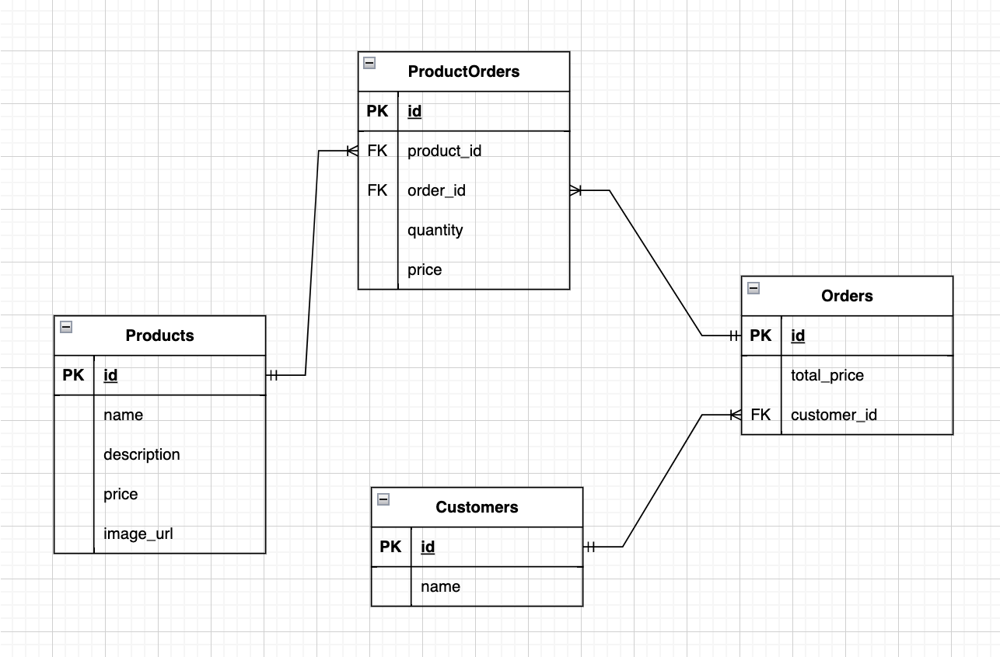

## BACKEND APP

This app using nodejs, expressjs, postgresql, sequelize, and jest

## API Documentation

[Read API Documentations](docs/README.md)

### Install dependencies

```
npm install
```

### Create database

Change database configuration in `config/config.json` and run this command

```
npm run db:create
```

### Run app

```
npm run dev
```

### Run tests

```
npm run test
```

### Run tests with coverage

```
npm run test:coverage
```

## Entity Relationship Diagram


