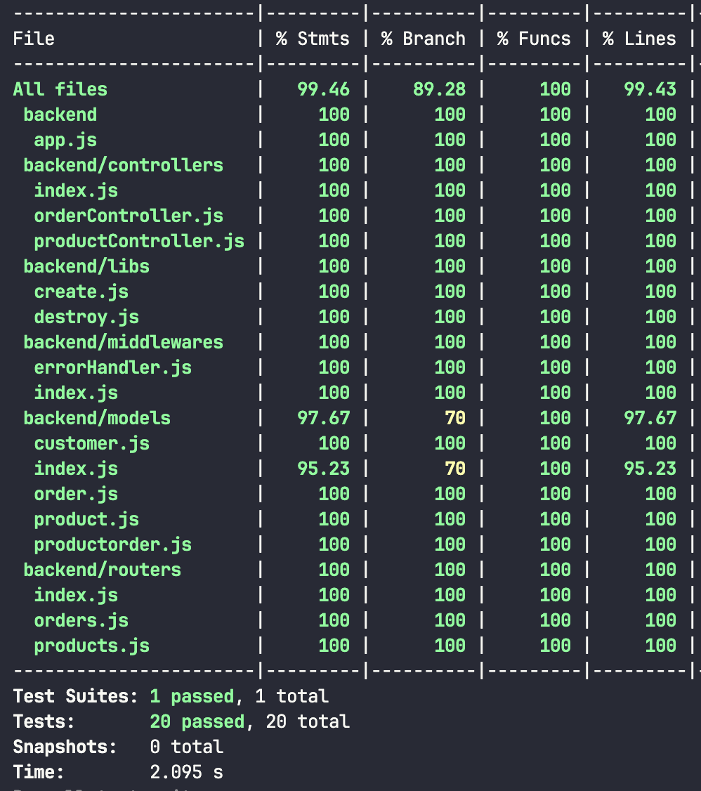
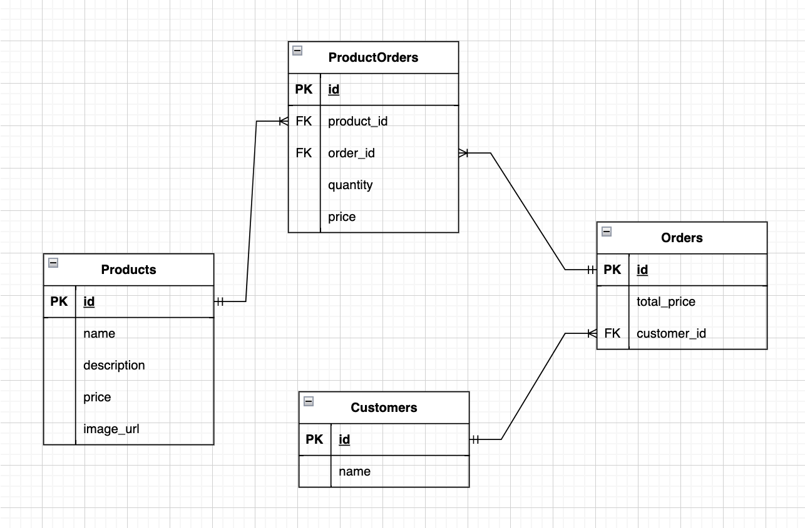

## BACKEND APP

This app using nodejs, expressjs, postgresql, sequelize, and jest, you can clone this repo and run this app in your local machine. make sure you have installed nodejs and postgresql in your local machine.

### Clone this repo

open your terminal and run this command

```
git clone git@github.com:liu-purnomo/fullstack-test.git
```

than go to backend folder

```
cd backend

```

## Read API Documentation

[Read API Documentations](docs/README.md)

### Install dependencies

```
npm install
```

### Create database

Change database configuration in `config/config.json` and run this command

```
npm run db:dev
```

### Run app

```
npm run dev
```

### Create Database for test

Change database configuration in `config/config.json` and run this command

### Migration

```
npm run db:test

```

### Run tests

```
npm run test
```

## Test Coverage Report



## Entity Relationship Diagram


